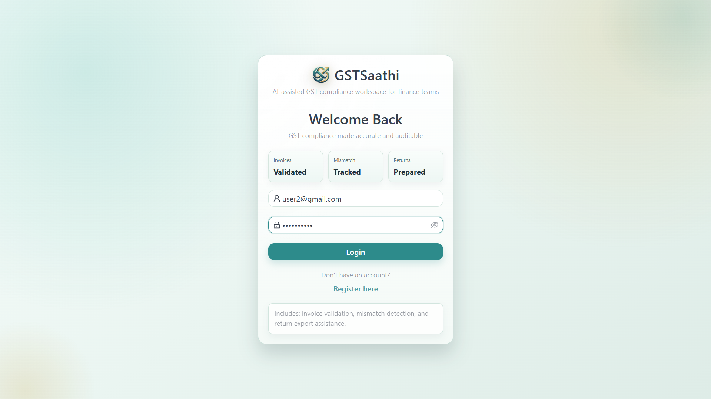
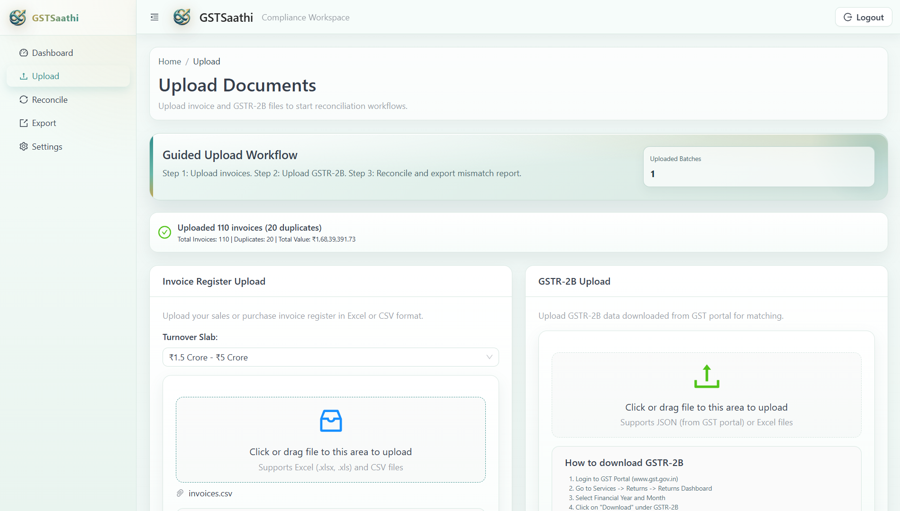
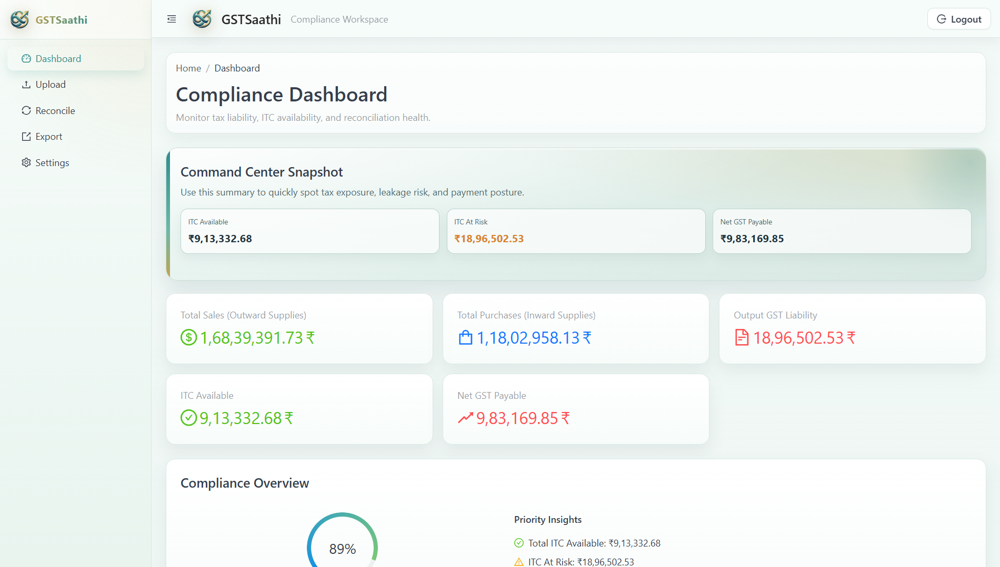
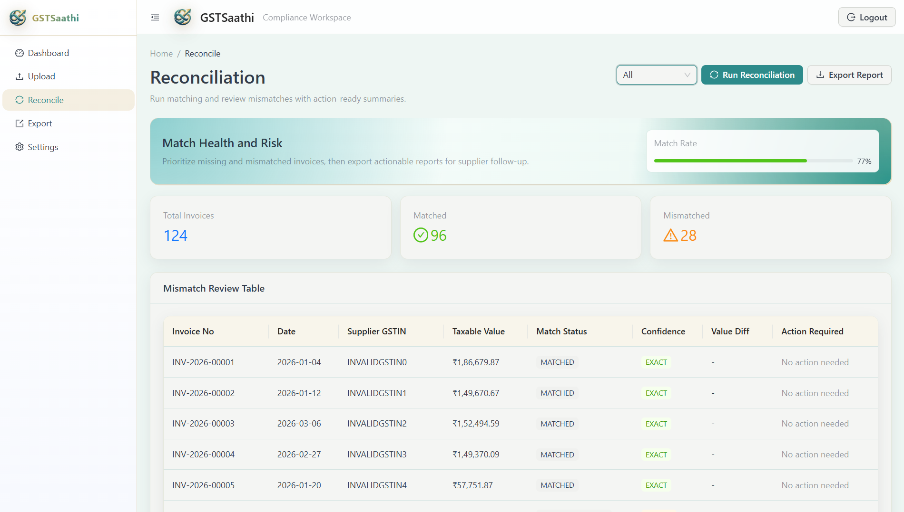
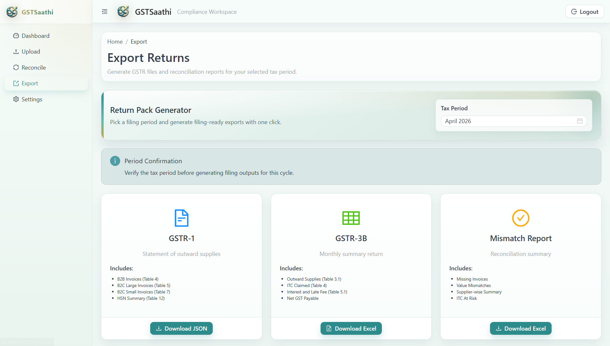
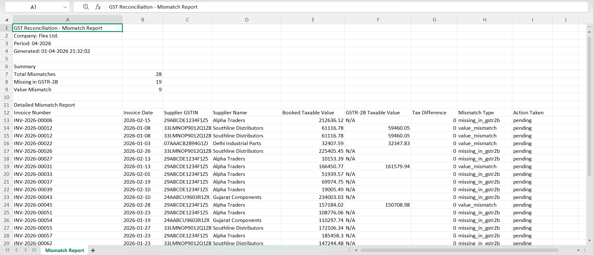

<div align="center">

# 🚀 GSTSaathi - GST Compliance Software

### 🤖 AI-Powered GST Compliance Automation for Indian MSMEs

[](https://github.com/your-repo/gst-compliance/releases)
[](https://github.com/your-repo/gst-compliance)
[](https://python.org)
[](LICENSE)

</div>

---

## 📑 Table of Contents

<details open>
<summary><b>Click to expand/collapse sections</b></summary>

- [Overview](#-overview)
- [Key Features](#-key-features)
- [Tech Stack](#-tech-stack)
- [System Architecture](#-system-architecture)
- [Project Structure](#-project-structure)
- [Getting Started](#-getting-started)
- [API Endpoints](#-api-endpoints)
- [AI Agents](#-ai-agents)
- [Current Status](#-current-status)
- [Success Criteria](#-success-criteria)
- [Common Issues](#-common-issues)
- [Screenshots](#-screenshots)

</details>

---

## 📖 Overview

<div align="center">

**GSTSaathi** is an intelligent GST compliance automation tool designed specifically for Indian MSMEs. It leverages a **multi-agent AI architecture** built with [smolagents CodeAgents](https://github.com/huggingface/smolagents) to automate invoice management, ITC reconciliation, and GST return filing.

</div>

<table>
<tr>
<td align="center" width="33%">

### 🎯 Target Users

Indian MSMEs seeking GST compliance automation

</td>
<td align="center" width="33%">

### ⚡ Processing Speed

1000 invoices in <30 seconds

</td>
<td align="center" width="33%">

### 🎯 Accuracy

100% GSTIN validation accuracy

</td>
</tr>
</table>

---

## ✨ Key Features

<div align="center">

|  <div style="font-size:24px">📤</div> **Upload**  | <div style="font-size:24px">✅</div> **Validate**  | <div style="font-size:24px">🔄</div> **Reconcile** |
| :-----------------------------------------------: | :------------------------------------------------: | :------------------------------------------------: |
| Excel/CSV drag-drop upload with automatic parsing |    Real-time GSTIN format + checksum validation    |       Auto-match invoices with GSTR-2B data        |
|  <div style="font-size:24px">🔍</div> **Detect**  | <div style="font-size:24px">📊</div> **Calculate** |  <div style="font-size:24px">📥</div> **Export**   |
|     Duplicate invoice detection automatically     |    Eligible ITC calculation with Section 17(5)     |            GSTR-1/3B JSON/Excel export             |

</div>

### Feature Highlights

<div style="background-color: #f6f8fa; border-left: 4px solid #2196F3; padding: 16px; border-radius: 4px; color: black; ">

- **📁 Excel/CSV Invoice Upload** — Drag-drop upload with automatic parsing
- **🔐 GSTIN Validation** — Real-time format and checksum validation (ValidatorAgent)
- **🚫 Duplicate Detection** — Flag duplicate invoices automatically (DataAgent)
- **🔄 GSTR-2B Reconciliation** — Auto-match invoices with GSTR-2B data (ReconciliationAgent)
- **💰 ITC Calculation** — Calculate eligible Input Tax Credit Section 17(5) (ComplianceAgent)
- **📄 GSTR-1/3B Export** — Generate GST portal-compatible JSON/Excel files (FilingAgent)
- **📊 Dashboard** — View compliance metrics, ITC at risk, mismatches

</div>

---

## 🛠️ Tech Stack

### Backend

<div align="left">

| Component           | Technology                 | Status |
| :------------------ | :------------------------- | :----: |
| **Framework**       | FastAPI 0.135+             |   ✅   |
| **Agent Framework** | smolagents 1.24+           |   ✅   |
| **LLM Framework**   | LangChain 1.2+             |   ✅   |
| **LLM**             | Gemini API                 |   ✅   |
| **Data Processing** | pandas 3.0+                |   ✅   |
| **Database**        | SQLite + SQLAlchemy 2.0+   |   ✅   |
| **Auth**            | JWT (python-jose) + bcrypt |   ✅   |
| **Vector Store**    | ChromaDB 1.5.5             |   ✅   |

</div>

### Frontend

<div align="left">

| Component            | Technology      | Status |
| :------------------- | :-------------- | :----: |
| **Framework**        | React 18 + Vite |   ✅   |
| **UI Library**       | Ant Design 5    |   ✅   |
| **State Management** | Zustand         |   ✅   |
| **HTTP Client**      | Axios           |   ✅   |
| **Styling**          | Tailwind CSS    |   ✅   |

</div>

---

## 📁 Project Structure

<details>
<summary><b>📂 View complete project structure</b></summary>

```
gst-compliance/
├── backend/
│   ├── app/
│   │   ├── main.py              # FastAPI app entry
│   │   ├── config.py            # Settings
│   │   ├── database.py          # DB connection
│   │   ├── models/              # SQLAlchemy models (6 tables)
│   │   ├── schemas/             # Pydantic schemas
│   │   ├── api/                 # REST routes (auth, upload, reconcile, export, dashboard)
│   │   ├── services/            # Business logic (auth, upload, export)
│   │   ├── agents/              # smolagents CodeAgents (6 P0 agents)
│   │   ├── utils/               # Utilities (GSTIN, HSN, ITC calculators)
│   │   └── middleware/          # Custom middleware
│   ├── uploads/                 # Uploaded files
│   ├── exports/                 # Generated exports
│   ├── gst_law_db/              # ChromaDB persistence
│   ├── requirements.txt
│   ├── .env
│   └── start.bat                # Windows quick start
├── frontend/
│   ├── src/
│   │   ├── components/          # React components
│   │   ├── pages/               # Page components
│   │   ├── api/                 # API client (axios)
│   │   ├── store/               # Zustand stores
│   │   ├── App.jsx
│   │   └── main.jsx
│   ├── package.json
│   ├── vite.config.js
│   └── start.bat                # Windows quick start
├── .gitignore
└── README.md
```

</details>

---

## 🚀 Getting Started

### Prerequisites

<div style="background-color: #fff3cd; border: 1px solid #ffc107; padding: 12px; border-radius: 4px;">

> **⚠️ Important:** Python 3.11 or 3.12 required (not 3.13+ due to ChromaDB compatibility)

</div>

| Requirement        | Version      | Get It                                              |
| :----------------- | :----------- | :-------------------------------------------------- |
| **Python**         | 3.11 or 3.12 | [python.org](https://python.org)                    |
| **Node.js**        | 18+          | [nodejs.org](https://nodejs.org)                    |
| **Gemini API Key** | -            | [Get Key](https://makersuite.google.com/app/apikey) |

### Backend Setup (Windows)

<details open>
<summary><b>📦 Step-by-step backend installation</b></summary>

**1. Navigate to backend directory:**

```cmd
cd backend
```

**2. Run quick start script:**

```cmd
start.bat
```

**Or manually:**

```cmd
python -m venv venv
venv\Scripts\activate
pip install -r requirements.txt
copy .env.example .env
```

**3. Edit `.env` and add your Gemini API key:**

```env
GEMINI_API_KEY=your_actual_api_key_here
```

**4. Start the server:**

```cmd
uvicorn app.main:app --reload
```

**5. Access API docs:** http://localhost:8000/docs

</details>

### Frontend Setup (Windows)

<details open>
<summary><b>🎨 Step-by-step frontend installation</b></summary>

**1. Navigate to frontend directory:**

```cmd
cd frontend
```

**2. Install dependencies:**

```cmd
npm install
```

**3. Start development server:**

```cmd
npm run dev
```

**4. Access the app:** http://localhost:5173

</details>

---

## 🔌 API Endpoints

### Authentication

|                                                           Method                                                            | Endpoint             | Description             |
| :-------------------------------------------------------------------------------------------------------------------------: | :------------------- | :---------------------- |
| <span style="background-color: #28a745; color: white; padding: 4px 8px; border-radius: 4px; font-weight: bold;">POST</span> | `/api/auth/register` | Register new user       |
| <span style="background-color: #28a745; color: white; padding: 4px 8px; border-radius: 4px; font-weight: bold;">POST</span> | `/api/auth/login`    | Login and get JWT token |

### Upload

|                                                           Method                                                            | Endpoint               | Description               |
| :-------------------------------------------------------------------------------------------------------------------------: | :--------------------- | :------------------------ |
| <span style="background-color: #28a745; color: white; padding: 4px 8px; border-radius: 4px; font-weight: bold;">POST</span> | `/api/upload/invoices` | Upload invoice Excel/CSV  |
| <span style="background-color: #28a745; color: white; padding: 4px 8px; border-radius: 4px; font-weight: bold;">POST</span> | `/api/upload/gstr2b`   | Upload GSTR-2B JSON/Excel |
| <span style="background-color: #007bff; color: white; padding: 4px 8px; border-radius: 4px; font-weight: bold;">GET</span>  | `/api/upload/history`  | Get upload history        |

### Reconciliation

|                                                           Method                                                            | Endpoint                        | Description                    |
| :-------------------------------------------------------------------------------------------------------------------------: | :------------------------------ | :----------------------------- |
| <span style="background-color: #28a745; color: white; padding: 4px 8px; border-radius: 4px; font-weight: bold;">POST</span> | `/api/reconcile/run`            | Run reconciliation             |
| <span style="background-color: #007bff; color: white; padding: 4px 8px; border-radius: 4px; font-weight: bold;">GET</span>  | `/api/reconcile/status/:job_id` | Get reconciliation status      |
| <span style="background-color: #007bff; color: white; padding: 4px 8px; border-radius: 4px; font-weight: bold;">GET</span>  | `/api/reconcile/results`        | Get reconciliation results     |
| <span style="background-color: #007bff; color: white; padding: 4px 8px; border-radius: 4px; font-weight: bold;">GET</span>  | `/api/reconcile/log`            | Get reconciliation run history |

### Export

|                                                           Method                                                           | Endpoint                      | Description              |
| :------------------------------------------------------------------------------------------------------------------------: | :---------------------------- | :----------------------- |
| <span style="background-color: #007bff; color: white; padding: 4px 8px; border-radius: 4px; font-weight: bold;">GET</span> | `/api/export/gstr1`           | Download GSTR-1 JSON     |
| <span style="background-color: #007bff; color: white; padding: 4px 8px; border-radius: 4px; font-weight: bold;">GET</span> | `/api/export/gstr3b`          | Download GSTR-3B Excel   |
| <span style="background-color: #007bff; color: white; padding: 4px 8px; border-radius: 4px; font-weight: bold;">GET</span> | `/api/export/mismatch-report` | Download mismatch report |

### Dashboard

|                                                           Method                                                           | Endpoint                 | Description           |
| :------------------------------------------------------------------------------------------------------------------------: | :----------------------- | :-------------------- |
| <span style="background-color: #007bff; color: white; padding: 4px 8px; border-radius: 4px; font-weight: bold;">GET</span> | `/api/dashboard/metrics` | Get dashboard metrics |
| <span style="background-color: #007bff; color: white; padding: 4px 8px; border-radius: 4px; font-weight: bold;">GET</span> | `/api/dashboard/summary` | Get dashboard summary |

---

## 🤖 AI Agents

<div align="center">

**The P0 MVP includes 6 smolagents CodeAgents working together:**

</div>

<table>
<tr>
<td align="center" style="background-color: #e3f2fd;padding: 16px;color:black;">

### 🔍 ValidatorAgent

**Purpose:** Validate GSTIN format + checksum, HSN code

**Tools:**

- validate_gstin()
- validate_hsn_code()

</td>
<td align="center" style="background-color: #f3e5f5;padding: 16px;color:black;">

### 📊 DataAgent

**Purpose:** Parse Excel/CSV, detect duplicates, transform data

**Tools:**

- parse_excel()
- detect_duplicates()

</td>
<td align="center" style="background-color: #e8f5e9;padding: 16px;color:black;">

### 🔄 ReconciliationAgent

**Purpose:** Match invoices with GSTR-2B, classify mismatches

**Tools:**

- exact_match_invoices()
- classify_mismatch()

</td>
</tr>
<tr>
<td align="center" style="background-color: #fff3e0;padding: 16px;color:black;">

### ✅ ComplianceAgent

**Purpose:** Calculate eligible ITC, apply Section 17(5)

**Tools:**

- calculate_eligible_itc()
- calculate_net_gst_liability()

</td>
<td align="center" style="background-color: #fce4ec;padding: 16px;color:black;">

### 📄 FilingAgent

**Purpose:** Generate GSTR-1 JSON, GSTR-3B Excel

**Tools:**

- generate_gstr1_return()
- generate_gstr3b_return()

</td>
<td align="center" style="background-color: #e0f7fa; padding: 16px;color:black;">

### 🎯 OrchestratorAgent

**Purpose:** Coordinate agent workflows

**Tools:**

- process_invoice_upload()
- run_reconciliation()

</td>
</tr>
</table>

---

## 📊 Current Status

### ✅ Completed

<div style="background-color: #d4edda; border-left: 4px solid #28a745; padding: 16px; border-radius: 4px;color:black;">

- ✅ Backend project structure
- ✅ Database models (6 tables: users, companies, invoices, gstr2b_entries, reconciliation_results, audit_logs)
- ✅ API routes (auth, upload, reconcile, export, dashboard)
- ✅ Services (auth_service, upload_service, export_service)
- ✅ Utility modules (GSTIN validator, HSN validator, ITC calculator)
- ✅ 6 AI Agents using smolagents
- ✅ Frontend project structure
- ✅ Frontend API client and Zustand stores

</div>

### 🚧 Next Steps

<div style="background-color: #fff3cd; border-left: 4px solid #ffc107; padding: 16px; border-radius: 4px;color:black;">

1. 🔲 Install backend dependencies and test server startup
2. 🔲 Install frontend dependencies and test server startup
3. 🔲 Create sample test data (invoices.xlsx, gstr2b.json)
4. 🔲 Test end-to-end flow with sample data
5. 🔲 Implement remaining frontend pages

</div>

---

## 📈 Success Criteria

<div align="center">

| Metric                 | Target                        | Status |
| :--------------------- | :---------------------------- | :----: |
| **Invoice Processing** | 1000 invoices in < 30 seconds |   🎯   |
| **Reconciliation**     | 500 matches in < 10 seconds   |   🎯   |
| **Dashboard Load**     | < 2 seconds                   |   🎯   |
| **GSTIN Validation**   | 100% accuracy                 |   🎯   |

</div>

---

## 🔧 Common Issues

<details>
<summary><b>❌ ChromaDB Python Version Error</b></summary>

**Error:** `ChromaDB is not supported for versions greater than python 3.12`

**Solution:** Use Python 3.11 or 3.12 (not 3.13+)

</details>

<details>
<summary><b>❌ Gemini API Not Working</b></summary>

**Check:** Ensure `GEMINI_API_KEY` is set in `.env` file

**Get Key:** https://makersuite.google.com/app/apikey

</details>

<details>
<summary><b>❌ pandas 3.0 Breaking Changes</b></summary>

**Reference:** See https://pandas.pydata.org/docs/whatsnew/v3.0.0.html

</details>

---

## 📸 Screenshots

<div>

**1. Login Page**



**2. Invoice Upload**



**3. Dashboard Overview**



**4. Reconciliation Results**



**5. Export Reports**



**6. Exported Report Excel**


</div>

---

## 🧪 Testing

### Generate Sample Data

From `backend/` run:

```bash
python tests/generate_sample_data.py
```

**This generates:**

- `backend/tests/sample_data/invoices.csv` (1000+ rows, includes duplicates and invalid GSTIN samples)
- `backend/tests/sample_data/gstr2b.json` (~80% match set with mismatches)

### Suggested Validation Flow

1. Register and login in frontend
2. Create company profile in Settings
3. Upload `invoices.csv` and `gstr2b.json`
4. Run reconciliation and review mismatch table and reconciliation log
5. Verify dashboard cards and ITC-at-risk widget
6. Export GSTR-1, GSTR-3B, and mismatch report

---

## 📄 License

<div align="center">

[](LICENSE)

**MIT License** - See [LICENSE](LICENSE) file for details

</div>
